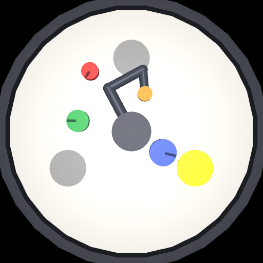
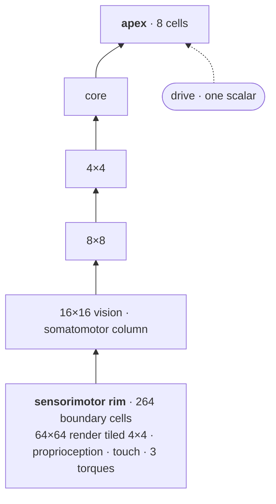

# Patchworks

[](docs/spec/)
[](#-try-it-yourself)
[](docs/adr/)
[](prototypes/sandbox/)
[](prototypes/sandbox/)
[](LICENSE)

*Patches of a manifold, each cell in its own chart. And a quilt of research pieces, assembled by
taste.*

---

Both readings of the name are meant. The first is the architecture: a world too big for any one
predictor, cut into pieces small enough that each can be modelled flat, and stitched back together
by making the seams disagree as little as possible. The second is the method. None of the ideas
here is new on its own. The bet is on the conjunction, and the conjunction is a matter of taste
until it runs.

<p align="center">
  
</p>

<p align="center"><em>The sandbox, today. The arm is pushing the blue puck; the lit zone is where
it has been asked to put it. There is no agent yet — this frame was driven by constant torque.</em></p>

> 🚧 **This is a specification, not a system.** Nothing has been trained. The design is finished —
> ten spec files, thirteen decision records, and a sandbox that runs — worked out to the point where
> a build can start cold with no architectural question left open. The two loops that belong at the
> top of this page (*I moved the puck* · *I changed the goal*) don't exist until it does.

What *does* run is the world, the dome's construction, and an untrained agent driving the arm. On
any machine that can run a container — no clone, no venv, no interpreter version to have:

```bash
docker run --rm ghcr.io/ngl321/patchworks doctor  # can this installation run? a line per check, and the fix
docker run --rm ghcr.io/ngl321/patchworks check   # is it alive? ~4 s headless, and the numbers a bug report wants
docker run --rm ghcr.io/ngl321/patchworks run     # leave it running: headless, a line every 500 ticks, Ctrl-C to stop
```

`linux/amd64` and `linux/arm64`, each built on its own hardware and each run — `doctor` and
`check` — before it is published, on every push and once a week
([`docker.yml`](.github/workflows/docker.yml)). That is the whole of what "supported" means here,
and it is why the container is the target rather than one of several
([ADR-0012](docs/adr/0012-a-container-is-the-supported-execution-target.md)).

**What is headless, and what needs a screen.** `doctor`, `check`, `run`, `dome`, the benchmarks and the
suite open no window and are the default tag. Everything that does open one — `demo`, the
two-window surface, **and `--replay`, which opens a frame window of its own even though it renders
no scene** — needs the `:desktop` tag, which carries an X server and serves it to a browser:

```bash
docker run --rm -p 6080:6080 ghcr.io/ngl321/patchworks:desktop demo
# then open http://localhost:6080/vnc.html
```

`patchworks` on its own lists the rest — `dome` for the graph's shape, `demo` for the scene window
you can interfere with by hand. Running on the host instead, from a clone and a venv, is
[below](#-try-it-yourself) and is best-effort rather than claimed: it works, and nothing but the
container has automated evidence behind it on more than one architecture. There is no `mjpython` to
remember either way: `demo` finds it, or stops and tells you the command.

## 🧩 The conjunction

Five commitments, none of which is remarkable alone:

- **Small, rigid predictors.** Every cell computes in twelve dimensions and talks in thirty-two —
  narrower inside than out, which is the whole reason it has to model anything.
- **A cellular sheaf, not an atlas.** Each cell has its own basis and its own scale. An atlas would
  demand they all share a dimension; a sheaf is that idea with the requirement removed, and it is
  the sharpest answer to *why a sheaf*.
- **Local rules only.** No gradient crosses a cell boundary. Two rules — one trains a cell's
  inference on its own prediction error, the other trains its transport on how much it disagrees
  with its neighbours — sharing no objective.
- **Two phases a tick.** Predict, then reconcile: exactly one descent step, never a solve.
- **No reward.** Behaviour comes from prediction error, from a single scalar written in from
  outside asserting that something is satisfied when it isn't, and from a human interfering.

Take any one away and the others don't obviously stand up. That is the thesis, and it is why there
is no ablation study in the plan.

## 🏛 The shape

~150 predicting cells, all running the same frozen network, tapering from a two-dimensional sheet
of sensors to an apex of eight.



Two windows, when it runs. On the left, the arm. On the right, that graph drawn as stacked bands —
sensors at the bottom, apex at the top — where a cell lights up when it is wrong.

Poke the arm and the bottom bands flare, then settle, in about a tick. Slide a puck out from under
what it was doing and the flare climbs — four levels up, into cells that hold their content for
hundreds of ticks and don't give it up for one contrary neighbour. Change the goal and it goes all
the way to the top.

**That is the demonstration.** Not that it recovers — that where it recovers from tells you what
you did to it.

## 👁 What one cell sees

<p align="center">
  
</p>

The agent's whole visual field, at the resolution it actually arrives in, with the tiling drawn
on. **Each square is one cell's entire view of the world.** A puck is 4 to 7 pixels across, so no
cell ever sees one whole — which means a puck only exists as something several cells have to agree
about. There is no privileged channel that hands anyone an object.

A goal arrives the same way: no scalar, no task vector. The target zone simply lights up in the
render, and one number at the apex asserts *this is satisfied* while it isn't.

## 🎯 What it will be judged by

One live interaction, fixed in advance. A human does three things in sequence — knocks the arm,
teleports a puck, changes the goal — and the measurement is **how long until the first corrective
torque**, per event. Not whether it recovers. How *far in* the recovery had to come from.

The design also says what would falsify it. Structured disagreement that never drains on an edge
means the world is curved where the model assumed it was flat. Behaviour identical across
different tasks means one scalar was never enough to steer 150 cells. An arm that stalls mid-swing
means two routes blended into standing still.

## 🔬 How it was built

**Design first, cite afterwards** — a deliberate inversion, and the one process decision worth
knowing about. Every architectural choice was made from implicit knowledge and written down before
any literature was read. Only then did a citation pass go looking for what the field already knew.

It has been a productive way to be wrong. The literature has contradicted the *reason* for a
decision far more often than the decision itself: the argument for uniform cell dimension turned
out to rest on a neuroscience claim nobody makes, the case against relay cells was right for the
wrong reason, and a remembered result about Rao's cross-map transfer turned out not to be in the
paper at all. Each is a closed ticket with the correction in it.

It has also turned up two things nobody appears to have done. Getting timescale separation out of
*persistence alone* — no schedule, no gate, no rate parameter per unit — is, as far as fourteen
citation passes can tell, without precedent. And engineering a network's Jacobian spectra to be
**wide** cuts against a literature that spends its time trying to make them narrow.

## ▶️ Try it yourself

The way you should eventually meet this project is a published package and a trained model, where
you watch it work and interfere with it by hand. **That doesn't exist yet** — no release, no
weights, nothing to install.

What does exist is the world it will have to live in, and half the acceptance demo works today.

### In a container

The supported target, and the shortest route to all of it
([ADR-0012](docs/adr/0012-a-container-is-the-supported-execution-target.md)). Two tags off one
Dockerfile: the default one is headless and is the guaranteed floor, and `:desktop` is that image
plus an X server, a window manager and noVNC.

```bash
docker run --rm ghcr.io/ngl321/patchworks doctor          # every check, and the fix for each
docker run --rm ghcr.io/ngl321/patchworks check           # the untrained agent, driving the arm
docker run --rm ghcr.io/ngl321/patchworks run             # the same, for as long as you like, reporting as it goes
docker run --rm ghcr.io/ngl321/patchworks dome            # the dome, and what construction records
docker run --rm --entrypoint pytest ghcr.io/ngl321/patchworks       # the suite, in the image
docker run --rm --entrypoint python ghcr.io/ngl321/patchworks \
    benchmarks/achievability.py                           # the scripted lower bound
```

`ENTRYPOINT` is `patchworks`, so a command reads the way the CLI does; `--entrypoint` is how the
suite and the benchmarks are reached. Mount something on `/work` and a run's artifacts outlive the
container:

```bash
docker run --rm -v patchworks-work:/work -p 6080:6080 ghcr.io/ngl321/patchworks:desktop \
    -- python -m patchworks.surface.watch --ticks 2000 --save /work/run.npz
```

The desktop tag's entrypoint starts the display, unsets `MUJOCO_GL` — `demo` runs the viewer and
the observation render in one process, and the viewer needs the GLX backend rather than the
headless osmesa one — and then execs a `patchworks` command, or, after a `--`, whatever you asked
for. Open <http://localhost:6080/vnc.html> to watch and to drive it.

**What the demo runs on in there is mesa's software GL**, for the window and for the 64×64
observation render alike. It is fast enough to drive by hand and it is not the host's numbers.

**What is verified in there, and what rests on a human at the screen.** Both windows open on the
container's own X server — the scene viewer and the panel beside it — and `doctor` passes through
the display stack, both on every push. Whether each *gesture* survives the browser round-trip is
checked by hand, and any that does not will be named right here rather than treated as a blocker:
the headless tier is the floor, and the desktop tier is honest about what it delivers.

### Developing on the host

A clone, a venv and the commands run directly. This is what the container packages, and it is
**best-effort rather than claimed**: the container is the only target with automated evidence
behind it on more than one architecture, and every block below is POSIX.

```bash
python3.12 -m venv .venv-proto
.venv-proto/bin/pip install 'mujoco==3.10.0' gymnasium numpy imageio
```

`mujoco` is pinned: newer releases ship no macOS **x86_64** wheels and try to build from source.

```bash
cd prototypes/sandbox

../../.venv-proto/bin/python watch.py              # scripted pusher, live viewer
../../.venv-proto/bin/python watch.py --babble     # motor babble instead
../../.venv-proto/bin/python probe.py              # headless: shapes, reset semantics, sampler
../../.venv-proto/bin/python achievable.py         # solve rate over sampled tasks
../../.venv-proto/bin/python precedence_probe.py   # the timescale ladder, and route-blocking
```

In the viewer, **ctrl-drag a puck** and you are performing event 2 of the acceptance demo by hand —
against a hard-coded controller instead of a graph. Press `r` to rearrange the world without
resetting the arm.

Three pucks with different mass and friction, one deliberately off-balance so that its rotation
matters and you cannot see that it does. The scripted controller, with perfect knowledge of every
position, solves **12 of 48** tasks. That is the bar.

The same world now lives in the `patchworks` package, as a literal `gymnasium.Env`:

```bash
python3.12 -m venv .venv
.venv/bin/pip install -e '.[dev]'
.venv/bin/pytest                                   # the world, held against the spec
.venv/bin/python benchmarks/achievability.py       # the scripted lower bound: 14 of 72, in ~3-4 min
.venv/bin/python benchmarks/timescale_selection.py # the timescale go/no-go, in ~2 min
.venv/bin/patchworks doctor                        # can this installation run, and what to do if not
.venv/bin/patchworks dome                          # the dome, and what construction records
.venv/bin/patchworks check                         # the untrained agent, driving the arm, in ~4 s
.venv/bin/patchworks run                           # the same, unbounded, printing that it is progressing
.venv/bin/patchworks demo                          # the scene window, and your hands in it
```

`patchworks demo` opens a MuJoCo window, and on macOS a MuJoCo window has to own the process's main
thread — which only MuJoCo's `mjpython` launcher gives it. **You do not have to know that**: `demo`
finds `mjpython` and re-execs into it, or stops and prints the exact command.

**Watch it run.** Two windows: MuJoCo's viewer over the arena, and the dome panel beside it — prediction
error per cell, the somatomotor strip, and `‖Δ(private component)‖` against depth
([`docs/spec/10-the-demo-surface.md`](docs/spec/10-the-demo-surface.md)).

```bash
.venv/bin/mjpython -m patchworks.surface.watch --ticks 2000 --save run.npz
.venv/bin/python   -m patchworks.surface.watch --replay run.npz
```

**Shift-ctrl-drag** a link or a puck and you are performing events 1 and 2 of the acceptance demo by
hand; left-double-click a puck and then a zone for event 3, and `r` rearranges the world without
resetting the arm. `1`-`9` cycle the goal pairs. Replay needs no scene window and runs under plain
`python` — but it is not display-free: it opens a frame window of its own, so in a container it is
the `:desktop` tag like everything else that opens one. The panel is closable and closing it changes nothing but the view; `--pitch` sizes a
lattice slot and `--scale` sizes the window.

<sub>These instructions live here and only here. `prototypes/sandbox/README.md` describes what the
files in that directory are and what broke while building them; it does not repeat setup.</sub>

## 🗺 Where things are

| | |
|---|---|
| [`docs/spec/`](docs/spec/) | Ten files, in reading order. The system, completely specified. Start with [the cell and its sheaf](docs/spec/01-cell-and-sheaf.md). |
| [`docs/adr/`](docs/adr/) | Thirteen decisions that needed a reason on the record. |
| [`docs/research/`](docs/research/) | The citation passes, including the ones that found defects. |
| [`docs/registers/`](docs/registers/) | Every constant the architecture rests on, typed by where the number came from, and what turning it would cost. Generated from the definition sites, so it cannot disagree with the code. |
| [`CONTEXT.md`](CONTEXT.md) | The vocabulary. Narrow senses, deliberately. |
| [`src/patchworks/sandbox/`](src/patchworks/sandbox/) | The world, as a `gymnasium.Env`. |
| [`src/patchworks/graph.py`](src/patchworks/graph.py) | The dome: construction, the structural masks, and the diagnostics it records. |
| [`src/patchworks/timescales.py`](src/patchworks/timescales.py) | Bias selection, and the go/no-go that can kill the timescale mechanism before anything is trained. |
| [`prototypes/sandbox/`](prototypes/sandbox/) | The throwaway it was promoted from, and the probes that measured it. |
| [Issue #1](https://github.com/NGL321/patchworks/issues/1) | The map every one of those decisions was made on. |

---

<sub>MIT licensed. A fun project, not an academic bet — absolute performance is not the point; the
architecture composing and running is.</sub>
