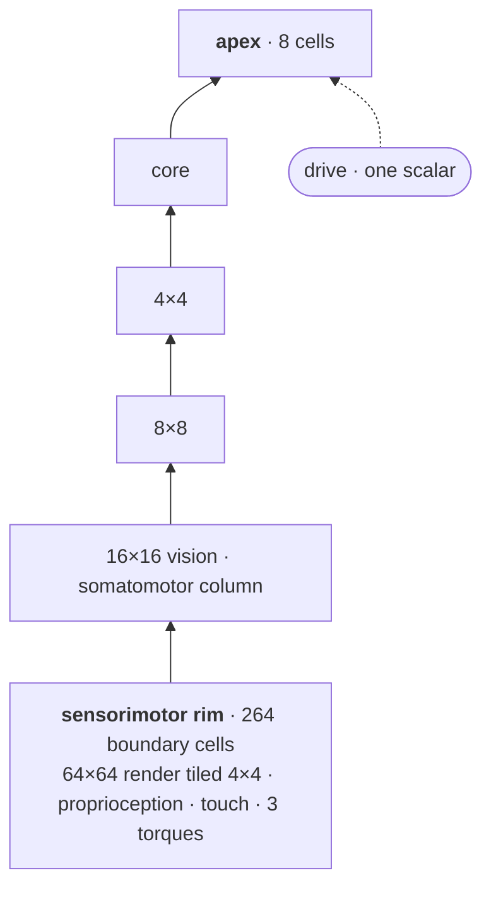

# Patchworks

<!-- HERO SLOT — reserved by docs/spec/10-the-demo-surface.md §"The front door".
     Two loops side by side, captioned "I moved the puck" and "I changed the goal".
     Cannot be captured until something is trained. Until then, the diagram below
     stands in its place and is deleted when the loops land. -->

> **Nothing is trained yet.** The two loops that belong at the top of this page don't exist.
> What follows is the design they will demonstrate.

---

## What you would be looking at

Two windows. On the left, an arm pushing pucks around a table. On the right, the graph that is
driving it, drawn as stacked bands — the sensors at the bottom, the deepest cells at the top.
Cells light up when they are wrong.



Poke the arm and the bottom bands flare, then settle, in about a tick. Slide a puck out from under
what it was doing and the flare climbs — four levels up, seconds later, into cells that hold their
content for hundreds of ticks. Change the goal and it goes all the way to the top.

**That is the demonstration.** Not that it recovers — that where it recovers from tells you what
you did to it.

## What is actually in there

**One network, ~150 copies.** Every predicting cell runs the same frozen weights. A cell is
individual only in its biases and in the maps to its neighbours — and those maps are what its
features come to *mean*.

**Nobody sees the whole picture.** The camera is tiled at 4×4 pixels. A puck is 4 to 7 pixels
across. No cell ever sees one whole, so the only way a puck exists is as something several cells
have to agree about.

**Disagreement is the only error signal.** No loss travels across the graph. Two neighbours
restrict their beliefs into a shared space, and whatever gap is left is what they learn from.
There is no reward channel at all.

**A goal is one number.** Written into a single cell at the very top, asserting *this is
satisfied* — and it isn't, so the graph carries discomfort it can only get rid of by moving the
arm. The render already says which puck and which zone; the goal only has to say *now*.

## Try the world

The agent doesn't exist. The world does.

```
cd prototypes/sandbox && python watch.py
```

Ctrl-drag a puck and you are performing event 2 of the acceptance demo by hand, against a scripted
controller instead of a graph. ([Setup.](prototypes/sandbox/README.md))

Three pucks with different mass and friction, one of them deliberately off-balance so that its
rotation matters and you cannot see that it does. A scripted controller with perfect knowledge of
every position solves 12 of the 48 tasks.

## Read the design

Ten spec files in [`docs/spec/`](docs/spec/), written to be read in order, starting with
[the cell and its sheaf](docs/spec/01-cell-and-sheaf.md). Eleven decisions with reasons in
[`docs/adr/`](docs/adr/). The vocabulary — narrow, and load-bearing — in
[`CONTEXT.md`](CONTEXT.md).
